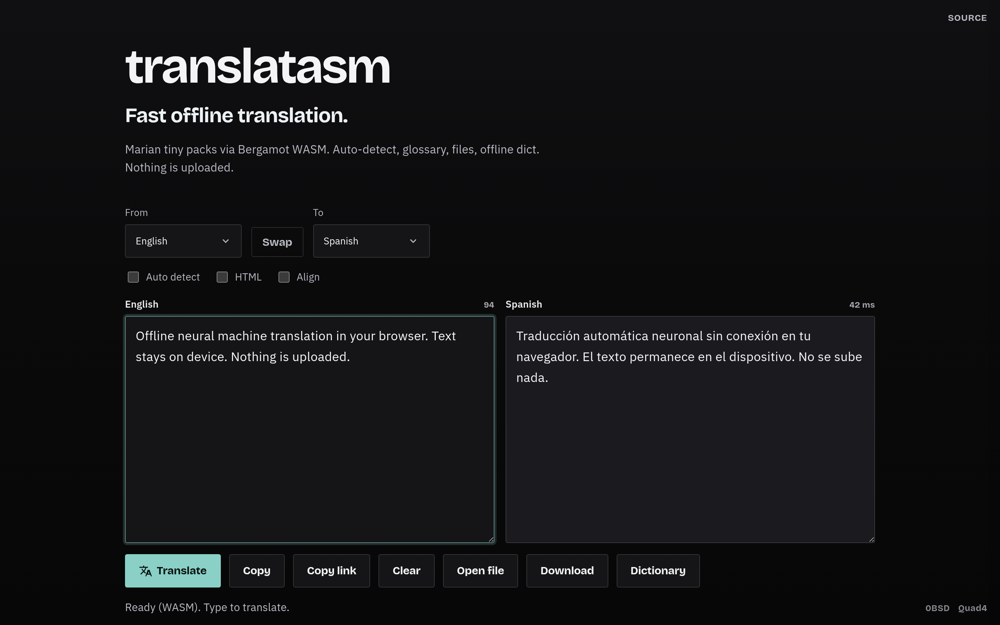

# translatasm

[](https://github.com/Quad4-Software/translatasm/actions/workflows/ci.yml) [](https://scorecard.dev/viewer/?uri=github.com/Quad4-Software/translatasm) [](https://github.com/Quad4-Software/translatasm/releases) [](https://github.com/Quad4-Software/translatasm/blob/master/LICENSE) [](https://go.dev/dl/) [](https://translatasm.quad4.io) [](https://github.com/orgs/Quad4-Software/packages/container/package/translatasm) [](https://translatasm.quad4.io)

Offline neural machine translation in the browser via Bergamot (Marian NMT) WASM.

**29 languages** (includes Chinese and Japanese when CJK packs are fetched), 56 direct packs with English pivot for cross pairs. Text stays on device after models load.

**Live:** [https://translatasm.quad4.io](https://translatasm.quad4.io)



## Languages

English, Bulgarian, Catalan, Chinese, Croatian, Czech, Danish, Dutch, Estonian, Finnish, French, German, Greek, Hungarian, Indonesian, Italian, Japanese, Norwegian, Polish, Portuguese, Romanian, Russian, Slovak, Slovenian, Spanish, Swedish, Turkish, Ukrainian, Vietnamese.

Chinese and Japanese packs need Firefox Translations WASM 2.x with CJK segmentation. Default build ships Bergamot 0.4.9. Enable with:

```bash
TRANSLATASM_CJK=1 make assets
```

That fetches 2.x language packs and Firefox Remote Settings WASM into `web/vendor/bergamot-firefox/`. The UI pre-segments CJK via `Intl.Segmenter`. Full drop-in of Firefox WASM 2.x as the sole engine still requires a worker bridge beyond npm 0.4.9.

## Install (Docker)

Clone and build (downloads Bergamot WASM + language packs into the image, ~1.2 GB):

```bash
git clone https://github.com/Quad4-Software/translatasm.git
cd translatasm
docker compose up --build
```

Open [http://127.0.0.1:8080](http://127.0.0.1:8080).

Pre-built multi-arch image (`linux/amd64`, `linux/arm64`):

```bash
docker pull ghcr.io/quad4-software/translatasm:latest
docker run --rm -p 8080:8080 ghcr.io/quad4-software/translatasm:latest
```

Or with Compose against the published image:

```bash
git clone https://github.com/Quad4-Software/translatasm.git
cd translatasm
IMAGE=ghcr.io/quad4-software/translatasm:latest docker compose up
```

Coolify: use `docker-compose.coolify.yml` and set the domain to container port `8080`.

CJK packs in the image:

```bash
docker compose build --build-arg TRANSLATASM_CJK=1
```

Optional host-side asset prefetch (only needed for source builds, not Docker):

```bash
make assets
TRANSLATASM_DICTS=1 make assets
```

## Release binaries

Tagged releases publish static Go servers for Linux, Windows, macOS, FreeBSD, OpenBSD, NetBSD (amd64, arm64, arm, 386, riscv64, and other supported arches).

```bash
curl -LO https://github.com/Quad4-Software/translatasm/releases/latest/download/translatasm_X.Y.Z_linux_amd64.tar.gz
tar xzf translatasm_*.tar.gz
./translatasm -web /path/to/web -addr :8080
```

The binary serves a `web/` tree. For a full offline tree, clone and run `make assets`, or use the container image (recommended).

## Build from source

Needs Go 1.26+, `curl`, `gunzip`, and Python 3.

```bash
git clone https://github.com/Quad4-Software/translatasm.git
cd translatasm
make assets   # WASM + Bergamot tiny packs + Firefox extras (~1.1 GB)
make run
```

Bergamot S3 only (no Firefox extras):

```bash
TRANSLATASM_EXTRAS=0 make assets
```

Subset of packs:

```bash
TRANSLATASM_PAIRS="enes esen enfr fren" TRANSLATASM_EXTRAS=0 make assets
```

```bash
make test
make bench
```

## Screenshots

Regen README images (Playwright, system Chromium when present):

```bash
make screenshots
```

Defaults to the live site. Local static `web/` or a running server:

```bash
SCREENSHOT_LOCAL=1 make screenshots
SCREENSHOT_URL=http://127.0.0.1:8080 make screenshots
```

Single shot: `node scripts/screenshot.mjs --only desktop` (after `make screenshots` once so `.tools` has Playwright). CI workflow **Screenshots** uploads fresh PNGs as artifacts on `workflow_dispatch`.

## Features

- Live typing translate with adaptive debounce and request supersede
- Sentence-level translation memory (only dirty sentences retranslate)
- Auto language detect (native LanguageDetector, optional cld3, heuristic fallback)
- Shareable URL (`?from=&to=&q=&html=1&auto=1`)
- HTML markup-aware translate when source looks like HTML
- File drop for `.txt` / `.md` / `.srt` with download
- Term glossary (do-not-translate) and vocab notebook with spaced review
- Offline dictionary drawer (Kaikki + FreeDict)

## Speed notes

- One Bergamot worker stays warm (no reload on language change)
- Sentence TM reuses prior targets so edits only hit dirty sentences
- Finished sentences flush immediately; the open sentence uses a short debounce
- In-flight WASM work is aborted on supersede (AbortSignal)
- Translation cache (~16k entries) and Firefox native IntGEMM when available
- Unused language packs are freed from the WASM heap and JS buffers when the pair changes
- Paragraph chunking for long text (HTML-safe splits when HTML mode is on)
- Direct packs when available, otherwise pivot through English

## Offline dictionary

Right-side drawer with bilingual glosses, trimmed monolingual defs, glossary, and a personal vocab notebook. Packs lazy-load on first lookup and cache via the service worker.

Fixture packs for English and Spanish ship in `web/dicts/`. Build more languages:

```bash
make dicts
# or a subset:
TRANSLATASM_DICT_LANGS="en es fr de" make dicts
```

Full Kaikki dumps are large. `TRANSLATASM_DICTS=1 make assets` also builds dicts. Cross-pair glosses fall back through English when a direct FreeDict pack is missing.

## License

0BSD
